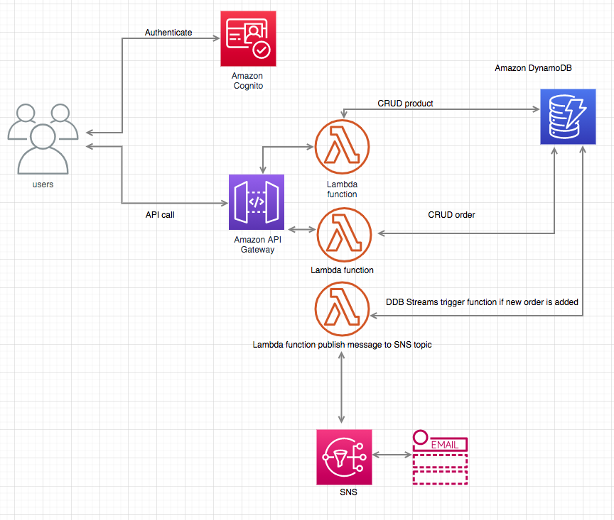

**DESCRIPTION**

- This is a simple demo project using AWS Services serverless

**FEATURES IN APPLICATION**

- User register account
- Admin manage products (CRUD)
- Customer can order product
- System send email to admin when user order product successfully
- Using CI/CD to deploy application

**AWS SERVICES ARE USING IN APPLICATION**

- IAM
- Cognito
- DynamoDB
- API Gateway
- Lambda
- S3
- CloudFomation
- SNS
- CloudWatch
- CodeBuild
- CodePipeline

**DIAGRAM ARCHITECTURE**

**INSTALL APP**
- Create pipeline stack using pipeline.yaml template file
- After pipeline stack is created, three stages of pipeline: Source, Build and Deploy running, all resources in main.yaml template are created

**SIGN-UP/LOGIN**
For POSTMAN, setup in Authorization tab
- Auth URL: https://product-delivery.auth.us-west-2.amazoncognito.com/login
- ClientID: 32kv6hqio5f6vptfl8qm61llsi
- Callback URL: https://example.com

OR HostedUIURL: https://product-delivery.auth.us-west-2.amazoncognito.com/login?client_id=32kv6hqio5f6vptfl8qm61llsi&response_type=token&scope=email&redirect_uri=https://example.com

**APIs**
- Create product: https://0nrifxek1k.execute-api.us-west-2.amazonaws.com/v0/products
- Request Body:
    {
        "product_id": 1,
        "name": "book",
        "price": 100,
        "quantity": 10
    }

- Create order: https://0nrifxek1k.execute-api.us-west-2.amazonaws.com/v0/orders
- Request Body:
    {
        "order_id": 1,
        "total_price": 100,
        "datetime": "2018-06-12"
    }
- Admin will receive an email when the user orders a product successfully.